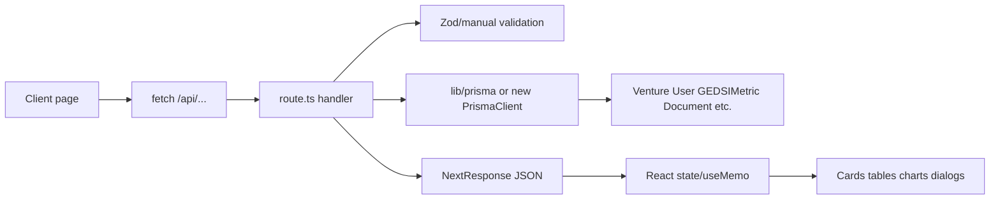

# MIV Frontend Architecture

Generated from the current source-controlled `miv` folder. Dependency/build/generated folders were excluded: `node_modules`, `.next`, `.git`, `coverage`, `dist`, build caches, and temporary files. This document does not infer behavior outside the files present in `miv`.

## 1. Executive Summary

The `miv` application is a Next.js App Router frontend and API layer for a Mekong Inclusive Ventures pipeline management system. It supports public marketing/intake surfaces, an internal admin dashboard, a founder/user dashboard, venture CRUD, GEDSI/IRIS metrics, document handling, workflows, team/project tools, fund-management views, AI analysis helpers, seed/test endpoints, and Prisma-backed persistence.

Main technologies:

- Next.js App Router with React 19 and TypeScript.
- Tailwind CSS 4, shadcn/ui-style primitives, Radix UI, lucide-react icons, and Recharts.
- Prisma ORM with PostgreSQL configured in `schema.prisma`.
- NextAuth v4 with Google and credentials providers.
- AI SDK clients for OpenAI, Anthropic, and Google Generative AI.
- React Hook Form, Zod, date-fns, react-dropzone, bcryptjs, nodemailer/resend.

Architectural style:

- Route-centric Next.js app with colocated `page.tsx`, `layout.tsx`, and `route.ts` files.
- Client-heavy frontend: every inspected page and dashboard layout starts with `"use client"` or uses client-only state/hooks.
- API routes are thin controllers that talk directly to Prisma and local services.
- Shared UI primitives live in `components/ui`; feature components live in `components`, `components/enterprise`, and `components/user`.
- Authentication is mixed: NextAuth, backend cookie/session rewrites, a `payload-token` middleware check, and development bypasses coexist.

Primary architectural responsibilities:

- `app`: browser routes, nested layouts, API route handlers, global CSS.
- `components`: navigation, dashboards, trackers, forms, and UI primitives.
- `hooks`: frontend authentication hook for the external `/backend` service.
- `lib`: Prisma singleton, AI clients, calculations, GEDSI/IRIS helpers, cache/mobile utilities, constants.
- `prisma`: database schema, migrations, local DB artifact, seed scripts.
- `scripts`: maintenance scripts including destructive venture deletion/restoration.
- `public`: brand and page assets.
- `docs`: existing product, architecture, setup, UX, and report documents.

## 2. Complete Folder Tree

Legend: `[source]` application/source code, `[api]` Next route handler, `[page]` route page, `[layout]` layout, `[config]` configuration, `[doc]` documentation, `[asset]` public/binary asset, `[db]` database/schema/migration, `[script]` script/tooling, `[backup]` backup/alternate file, `[env]` environment file, `[generated]` generated/relevant artifact.

```text
miv/
  .env [env]
  .env.example [env]
  .gitignore [config]
  README.md [doc]
  components.json [config]
  eslint.config.mjs [config]
  middleware.ts [source]
  next.config.mjs [config]
  next.config.ts [config]
  package-lock.json [config]
  package.json [config]
  pnpm-lock.yaml [config]
  postcss.config.mjs [config]
  tailwind.config.ts [config]
  tsconfig.json [config]
  app/
    favicon.ico [asset]
    globals.css [source]
    layout.tsx [layout]
    page.tsx [page]
    api/
      add-venture-details/route.ts [api]
      ai/analyze-venture/route.ts [api]
      ai/gedsi-insights/route.ts [api]
      analytics/route.ts [api]
      auth/[...nextauth]/route.ts [api]
      auth/set-password/route.ts [api]
      calculations/route.ts [api]
      calculations-simple/route.ts [api]
      calendar/analytics/route.ts [api]
      calendar/events/route.ts [api]
      calendar/events/[id]/route.ts [api]
      custom-dashboards/route.ts [api]
      documents/route.ts [api]
      documents/[id]/route.ts [api]
      documents/analytics/route.ts [api]
      documents/upload/route.ts [api]
      emails/logs/route.ts [api]
      emails/stg-reminder/route.ts [api]
      emails/weekly-update/route.ts [api]
      fund-management/route.ts [api]
      gedsi-metrics/route.ts [api]
      gedsi-metrics/[id]/route.ts [api]
      improve-gedsi-scores/route.ts [api]
      iris/metrics/route.ts [api]
      iris/metrics/[code]/route.ts [api]
      notifications/route.ts [api]
      search/route.ts [api]
      seed-basic/route.ts [api]
      seed-calculations/route.ts [api]
      seed-comprehensive-data/route.ts [api]
      seed-detailed-ventures/route.ts [api]
      seed-gedsi-metrics/route.ts [api]
      seed-gedsi-portfolio/route.ts [api]
      seed-sarah-analytics/route.ts [api]
      seed-simple/route.ts [api]
      seed-workflows/route.ts [api]
      session/login/route.ts [api]
      team/announcements/route.ts [api]
      team/announcements/[id]/route.ts [api]
      team/events/route.ts [api]
      team/events/[id]/route.ts [api]
      team/members/route.ts [api]
      team/members/[id]/route.ts [api]
      team/projects/route.ts [api]
      team/projects/[id]/route.ts [api]
      test-db/route.ts [api]
      test-sprint2/route.ts [api]
      users/route.ts [api]
      users/me/route.ts [api]
      users/ventures/route.ts [api]
      ventures/route.ts [api]
      ventures/[id]/route.ts [api]
      ventures/[id]/gedsi/route.ts [api]
      workflows/route.ts [api]
      workflows/[id]/route.ts [api]
      workflows/[id]/runs/route.ts [api]
      workflows/run/route.ts [api]
      workflows/runs/recent/route.ts [api]
    auth/
      login/page.tsx [page]
      register/page.tsx [page]
    dashboard/
      layout.tsx [layout]
      page.tsx [page]
      page-backup.tsx.bak [backup]
      advanced-reports/page.tsx [page]
      ai-analysis/page.tsx [page]
      calendar/page.tsx [page]
      capital-facilitation/page.tsx [page]
      capital-facilitation/page-fixed.tsx [backup]
      capital-facilitation/page-new.tsx [backup]
      custom-dashboards/page.tsx [page]
      deal-flow/page.tsx [page]
      diagnostics/page.tsx [page]
      documents/page.tsx [page]
      due-diligence/page.tsx [page]
      exit-strategy/page.tsx [page]
      fund-management/page.tsx [page]
      gedsi-tracker/page.tsx [page]
      help-support/page.tsx [page]
      impact-documents/page.tsx [page]
      impact-reports/page.tsx [page]
      investment-rounds/page.tsx [page]
      iris-metrics/page.tsx [page]
      notifications/page.tsx [page]
      performance-analytics/page.tsx [page]
      portfolio/page.tsx [page]
      social-impact/page.tsx [page]
      sustainability/page.tsx [page]
      system-settings/page.tsx [page]
      system-settings/page-enhanced.tsx [backup]
      team-management/page.tsx [page]
      test-environment/page.tsx [page]
      venture-intake/page.tsx [page]
      ventures/page.tsx [page]
      ventures/[id]/page.tsx [page]
      workflows/page.tsx [page]
      workflows/wizard/page.tsx [page]
      workflows/[id]/builder/page.tsx [page]
      workflows/[id]/monitor/page.tsx [page]
    test-comprehensive/page.tsx [page]
    test-data/page.tsx [page]
    user-dashboard/
      layout.tsx [layout]
      page.tsx [page]
      diagnostics/page.tsx [page]
      documents/page.tsx [page]
      documents/page1.tsx [backup]
      profile/page.tsx [page]
      support/page.tsx [page]
  components/
    auth-session-provider.tsx [source]
    breadcrumb.tsx [source]
    gedsi-tracker.tsx [source]
    global-search.tsx [source]
    logo.tsx [source]
    mobile-nav.tsx [source]
    readiness-tracker.tsx [source]
    sidebar.tsx [source]
    success-stories-slider.tsx [source]
    theme-provider.tsx [source]
    venture-intake-form.tsx [source]
    enterprise/
      advanced-data-table.tsx [source]
      advanced-filters.tsx [source]
      analytics-dashboard.tsx [source]
      notification-center.tsx [source]
      workflow-dashboard-tab.tsx [source]
    ui/
      alert.tsx [source]
      avatar.tsx [source]
      badge.tsx [source]
      button.tsx [source]
      card.tsx [source]
      chart.tsx [source]
      checkbox.tsx [source]
      dialog.tsx [source]
      dropdown-menu.tsx [source]
      file-upload.tsx [source]
      input.tsx [source]
      label.tsx [source]
      popover.tsx [source]
      progress.tsx [source]
      scroll-area.tsx [source]
      select.tsx [source]
      separator.tsx [source]
      sheet.tsx [source]
      switch.tsx [source]
      table.tsx [source]
      tabs.tsx [source]
      textarea.tsx [source]
      toast.tsx [source]
    user/
      documents.tsx [source]
      user-sidebar.tsx [source]
  docs/
    API_REFERENCE.md [doc]
    BEST_TECH_STACK_ANALYSIS.md [doc]
    BEST_TECH_STACK_SUMMARY.md [doc]
    CENTRALIZED_CALCULATIONS.md [doc]
    COMPLETE_PLATFORM_REBUILD_PLAN.md [doc]
    CONTRIBUTING.md [doc]
    CURRENT_STATE_ASSESSMENT.md [doc]
    Deakin MIV venture pipeline mgmt intro.pdf [doc]
    Deakin-MIV-venture-pipeline-mgmt-intro.txt [doc]
    DEVELOPMENT_SETUP.md [doc]
    DOCUMENTATION_ALIGNMENT_ANALYSIS.md [doc]
    ENTERPRISE_ARCHITECTURE.md [doc]
    IMPLEMENTATION_GUIDE.md [doc]
    INDIVIDUAL_RETROSPECTIVE.md [doc]
    IRIS+ 5.3b Catalog of Metrics.xlsx [doc]
    MIGRATION_STRATEGY.md [doc]
    MIV_Business_Case_5_Slides.md [doc]
    MIV_FULL_REPORT_COMBINED.md [doc]
    MIV_PIPELINE_CLARIFICATION.md [doc]
    MIV_PLATFORM_OVERVIEW.md [doc]
    PROJECT_STRUCTURE.md [doc]
    REACT_VS_NEXTJS_SUMMARY.md [doc]
    SECURITY_PRIVACY_CHECKLIST.md [doc]
    TECH_STACK_MARKET_COMPARISON.md [doc]
    TECH_STACK_SUMMARY.md [doc]
    USER_MANUAL.md [doc]
    UX_FLOWCHART_STRUCTURE.md [doc]
    WIREFRAMES_UX_GUIDE.md [doc]
  hooks/useAuth.ts [source]
  lib/
    ai-services.ts [source]
    cache-headers.ts [source]
    calculation-service.ts [source]
    constants.ts [source]
    gedsi-utils.ts [source]
    iris-catalog.json [source]
    iris-metrics.ts [source]
    mobile-detect.ts [source]
    prisma.ts [source]
    utils.ts [source]
  prisma/
    dev.db [db]
    schema.prisma [db]
    seed.ts [script]
    seed-test.ts [script]
    migrations/migration_lock.toml [db]
    migrations/20250912145815_initial_comprehensive_schema/migration.sql [db]
    migrations/20250916125922_add_workflows/migration.sql [db]
    migrations/20250916131756_add_user_password/migration.sql [db]
    migrations/20250917090928_add_fund_management/migration.sql [db]
    migrations/20250917133903_add_venture_metrics/migration.sql [db]
    migrations/20250917180536_add_calculated_fields/migration.sql [db]
  public/
    bg1.jpeg [asset]
    download.png [asset]
    logo.svg [asset]
    London Underground.jpeg [asset]
    michi-foriio.png [asset]
    placeholder.svg [asset]
  scripts/
    delete-ventures.ts [script]
    delete-ventures-interactive.ts [script]
    install-lightningcss.js [script]
    restore-old-ventures.ts [script]
  types/next-auth.d.ts [source]
```

## 3. Root-Level Files

- `miv/package.json`: package metadata, scripts, dependency graph. Scripts include Next dev/build/start, Prisma generate/push/migrate/studio/seed, test seed, and `postinstall`.
- `miv/package-lock.json` and `miv/pnpm-lock.yaml`: two lockfiles exist while `packageManager` declares pnpm. This is a package-manager consistency risk.
- `miv/next.config.ts`: TypeScript Next config with unoptimized images, `/backend/:path*` rewrite to `NEXT_PUBLIC_BACKEND_URL` or `PUBLIC_BACKEND_URL`, and dev origins `10.0.2.2`, `192.168.1.102`.
- `miv/next.config.mjs`: second Next config with overlapping rewrite logic and different dev origin `192.168.1.103`. Having both configs is ambiguous; Next will not intentionally merge them.
- `miv/tsconfig.json`: strict TypeScript, `allowJs`, bundler module resolution, JSX `react-jsx`, `@/*` path alias to project root, includes `.next` type outputs.
- `miv/tailwind.config.ts`: Tailwind design tokens, dark mode class strategy, MIV/GEDSI/status/chart colors, container settings, animation plugin.
- `miv/postcss.config.mjs`: Tailwind 4 PostCSS plugin.
- `miv/eslint.config.mjs`: Next core-web-vitals/typescript config with several TypeScript and React rules disabled.
- `miv/components.json`: shadcn/ui metadata, New York style, RSC enabled, aliases to `@/components`, `@/lib`, `@/hooks`, lucide icons.
- `miv/middleware.ts`: protects non-public non-API paths using a simple `payload-token` cookie presence check; bypasses dashboard/user-dashboard protection in non-production; lets `/` through when unauthenticated.
- `miv/.env`: source-controlled environment file. Contents were not printed here, but tracking `.env` is a security risk if it contains secrets.
- `miv/.env.example`: intended env template.
- `miv/.gitignore`: ignore rules for the app.
- `miv/README.md`: project overview/setup documentation.
- `miv/types/next-auth.d.ts`: NextAuth TypeScript augmentation, relevant source type glue.
- `next-env.d.ts`: not present in the tracked inventory. If generated locally, it should be considered a Next-generated type file and not deeply reviewed.

## 4. Next.js App Router Architecture

`miv/app` is the Next.js App Router root. Folders become route segments; `page.tsx` renders browser routes; `layout.tsx` wraps nested segments; `app/api/**/route.ts` files implement API endpoints.

Route map:

| Folder/file | Browser URL |
|---|---|
| `app/page.tsx` | `/` |
| `app/auth/login/page.tsx` | `/auth/login` |
| `app/auth/register/page.tsx` | `/auth/register` |
| `app/dashboard/page.tsx` | `/dashboard` |
| `app/dashboard/advanced-reports/page.tsx` | `/dashboard/advanced-reports` |
| `app/dashboard/ai-analysis/page.tsx` | `/dashboard/ai-analysis` |
| `app/dashboard/calendar/page.tsx` | `/dashboard/calendar` |
| `app/dashboard/capital-facilitation/page.tsx` | `/dashboard/capital-facilitation` |
| `app/dashboard/custom-dashboards/page.tsx` | `/dashboard/custom-dashboards` |
| `app/dashboard/deal-flow/page.tsx` | `/dashboard/deal-flow` |
| `app/dashboard/diagnostics/page.tsx` | `/dashboard/diagnostics` |
| `app/dashboard/documents/page.tsx` | `/dashboard/documents` |
| `app/dashboard/due-diligence/page.tsx` | `/dashboard/due-diligence` |
| `app/dashboard/exit-strategy/page.tsx` | `/dashboard/exit-strategy` |
| `app/dashboard/fund-management/page.tsx` | `/dashboard/fund-management` |
| `app/dashboard/gedsi-tracker/page.tsx` | `/dashboard/gedsi-tracker` |
| `app/dashboard/help-support/page.tsx` | `/dashboard/help-support` |
| `app/dashboard/impact-documents/page.tsx` | `/dashboard/impact-documents` |
| `app/dashboard/impact-reports/page.tsx` | `/dashboard/impact-reports` |
| `app/dashboard/investment-rounds/page.tsx` | `/dashboard/investment-rounds` |
| `app/dashboard/iris-metrics/page.tsx` | `/dashboard/iris-metrics` |
| `app/dashboard/notifications/page.tsx` | `/dashboard/notifications` |
| `app/dashboard/performance-analytics/page.tsx` | `/dashboard/performance-analytics` |
| `app/dashboard/portfolio/page.tsx` | `/dashboard/portfolio` |
| `app/dashboard/social-impact/page.tsx` | `/dashboard/social-impact` |
| `app/dashboard/sustainability/page.tsx` | `/dashboard/sustainability` |
| `app/dashboard/system-settings/page.tsx` | `/dashboard/system-settings` |
| `app/dashboard/team-management/page.tsx` | `/dashboard/team-management` |
| `app/dashboard/test-environment/page.tsx` | `/dashboard/test-environment` |
| `app/dashboard/venture-intake/page.tsx` | `/dashboard/venture-intake` |
| `app/dashboard/ventures/page.tsx` | `/dashboard/ventures` |
| `app/dashboard/ventures/[id]/page.tsx` | `/dashboard/ventures/:id` |
| `app/dashboard/workflows/page.tsx` | `/dashboard/workflows` |
| `app/dashboard/workflows/wizard/page.tsx` | `/dashboard/workflows/wizard` |
| `app/dashboard/workflows/[id]/builder/page.tsx` | `/dashboard/workflows/:id/builder` |
| `app/dashboard/workflows/[id]/monitor/page.tsx` | `/dashboard/workflows/:id/monitor` |
| `app/test-comprehensive/page.tsx` | `/test-comprehensive` |
| `app/test-data/page.tsx` | `/test-data` |
| `app/user-dashboard/page.tsx` | `/user-dashboard` |
| `app/user-dashboard/diagnostics/page.tsx` | `/user-dashboard/diagnostics` |
| `app/user-dashboard/documents/page.tsx` | `/user-dashboard/documents` |
| `app/user-dashboard/profile/page.tsx` | `/user-dashboard/profile` |
| `app/user-dashboard/support/page.tsx` | `/user-dashboard/support` |

Nested layout inheritance:

- `app/layout.tsx` wraps all routes. It loads Geist fonts, global CSS, theme provider, NextAuth session provider, and toast provider.
- `app/dashboard/layout.tsx` wraps all `/dashboard/**` routes. It is a client layout with desktop `Sidebar`, mobile `MobileNav`, `Breadcrumb`, loading state, and a development auth bypass.
- `app/user-dashboard/layout.tsx` wraps `/user-dashboard/**`. It is a client layout with `UserSidebar`, custom header/search/profile avatar, `Breadcrumb`, `/backend/api/users` user fetch, and a development auth bypass.

No `loading.tsx`, `error.tsx`, or `not-found.tsx` files are tracked under `miv/app`, so loading/error/not-found behavior is implemented inside individual client components rather than route-level boundaries.

## 5. Page-Level Deep Dive

All tracked `page.tsx` files are client components in current source. They use local state/effects for data loading and render loading/empty/error states manually where implemented.

| Page | URL | Purpose and role | Main imports/state/data | Auth/UX/risks |
|---|---|---|---|---|
| `app/page.tsx` | `/` | Public marketing/home page for MIV; unauthenticated visitors. | Uses `Logo`, `Button`, `Badge`, `Input`, images/icons, menu/accessibility/email state, scroll section tracking. | Public in middleware. Client scroll/accessibility controls. Risk: large landing page and local newsletter state without backend persistence in inspected imports. |
| `app/auth/login/page.tsx` | `/auth/login` | Login form for users/admins. | `Button`, `Input`, `Label`, `Alert`, password visibility/loading/error state; posts to backend/login URL through rewrite or configured endpoint. | Public. Mixed auth risk: login targets external `/backend` style API while NextAuth route also exists. |
| `app/auth/register/page.tsx` | `/auth/register` | Registration form. | Form data/password confirm/show password/loading/error; posts to backend registration URL. | Public. Validation is client-local; backend behavior is outside `miv`. |
| `app/dashboard/page.tsx` | `/dashboard` | Enterprise admin overview. | Imports enterprise dashboard/table/filter/notification/workflow components, theme/toast, GEDSI utils; fetches `/api/ventures`, `/api/gedsi-metrics`, `/api/iris/metrics`, `/api/users`; many `useMemo` analytics. | Internal role intended: admin/manager/analyst. Layout auth is bypassed in dev. Logout calls `/backend/api/users/logout`. Large monolithic page. |
| `app/dashboard/advanced-reports/page.tsx` | `/dashboard/advanced-reports` | Report and custom dashboard builder. | Fetches ventures, GEDSI metrics, users, analytics, workflows; state for reports, dashboards, charts, filters, schedule, drag layout. | Intended admin/manager. Risk: builder data partly local/generated; broad API exposure. |
| `app/dashboard/ai-analysis/page.tsx` | `/dashboard/ai-analysis` | AI analysis workspace for ventures. | Fetches `/api/ventures?limit=50`; state for selected venture/type/prompt/analyzing/results; uses cards/tabs/select/textarea/progress. | Intended analyst/admin. Risk: AI endpoint auth differs; expensive AI calls need throttling and auth. |
| `app/dashboard/calendar/page.tsx` | `/dashboard/calendar` | Calendar/event analytics. | Fetches `/api/calendar/events` with filters and `/api/calendar/analytics`; month matrix and events by day via `useMemo`. | Uses grid/list responsive patterns. API has no visible auth guard. |
| `app/dashboard/capital-facilitation/page.tsx` | `/dashboard/capital-facilitation` | Capital request and investor facilitation dashboard. | Fetches ventures; derives capital requests/investor partners/timeline; tabs/cards/progress/alerts. | Intended capital facilitator. Alternate `page-new.tsx` and `page-fixed.tsx` indicate stale experiments. |
| `app/dashboard/custom-dashboards/page.tsx` | `/dashboard/custom-dashboards` | Dashboard catalog and creation UI. | Fetches `/api/custom-dashboards` and ventures; state for category/view/create/edit/dialog/widgets. | API currently returns generated dashboards from users/ventures, POST stores only in memory response unless DB write exists. |
| `app/dashboard/deal-flow/page.tsx` | `/dashboard/deal-flow` | Pipeline/deal-flow board/table. | Fetches ventures; filters stage/sector/status/founder type; dialogs for view/edit/add; uses `calculateGEDSIScore`. | Large client component, many local modal states. |
| `app/dashboard/diagnostics/page.tsx` | `/dashboard/diagnostics` | Diagnostic/readiness questionnaire surface. | Uses `ReadinessTracker`, checkboxes, textarea, tabs, local form/progress state. | Appears mostly local/hardcoded. Accessibility depends on form labels. |
| `app/dashboard/documents/page.tsx` | `/dashboard/documents` | Admin document library and upload UI. | Fetches ventures, document analytics, documents; uploads to `/api/documents/upload`; deletes via `/api/documents/:id`; drag state. | Upload stores under `public/uploads` in API; no visible auth guard. |
| `app/dashboard/due-diligence/page.tsx` | `/dashboard/due-diligence` | Due diligence tracking. | Fetches ventures; computes readiness/GEDSI; cards/tables/progress. | Intended investment team. Risk: business rules live in UI. |
| `app/dashboard/exit-strategy/page.tsx` | `/dashboard/exit-strategy` | Exit planning/portfolio exit scenarios. | Uses Recharts/cards/tabs and venture data patterns. | Mostly analytic UI; verify live data use before relying operationally. |
| `app/dashboard/fund-management/page.tsx` | `/dashboard/fund-management` | Fund, LP, capital call, distribution, lifecycle dashboard. | Consumes `/api/fund-management`; heavy cards/tabs/charts. | Maps to Fund-related Prisma models. API is unauthenticated. |
| `app/dashboard/gedsi-tracker/page.tsx` | `/dashboard/gedsi-tracker` | GEDSI metric tracking. | Uses shared `GEDSITracker` component. | Depends on component-level API calls and local add-metric form. |
| `app/dashboard/help-support/page.tsx` | `/dashboard/help-support` | Admin help/support content. | Static/support UI with icons/cards. | Low data risk; likely hardcoded content. |
| `app/dashboard/impact-documents/page.tsx` | `/dashboard/impact-documents` | Impact document/report management. | Similar document-card pattern. | Needs verification against `/api/documents` for complete backend support. |
| `app/dashboard/impact-reports/page.tsx` | `/dashboard/impact-reports` | Impact reporting dashboard. | Uses charts, tabs, portfolio/venture metric data. | Risk: hardcoded/mock data likely mixed with API data. |
| `app/dashboard/investment-rounds/page.tsx` | `/dashboard/investment-rounds` | Investment round tracking. | Cards/tables/charts/state. | Verify endpoint coverage; no dedicated `investment-rounds` Prisma model. |
| `app/dashboard/iris-metrics/page.tsx` | `/dashboard/iris-metrics` | IRIS+ metric catalog/browser. | Uses `/api/iris/metrics` and possibly category/code filters. | Depends on `IRISMetricCatalog` and static `lib/iris-metrics.ts`/JSON. |
| `app/dashboard/notifications/page.tsx` | `/dashboard/notifications` | Notification inbox. | Uses notification cards/filters/read state pattern. | Consumes `/api/notifications`; auth is not evident. |
| `app/dashboard/performance-analytics/page.tsx` | `/dashboard/performance-analytics` | Portfolio performance analytics. | Recharts, venture/GEDSI fetch patterns, `useMemo` analytics. | Risk: calculations duplicated between UI and services. |
| `app/dashboard/portfolio/page.tsx` | `/dashboard/portfolio` | Portfolio company overview. | Uses venture data, score utilities, cards/tables. | Data exposed through unauthenticated `/api/ventures` in current code. |
| `app/dashboard/social-impact/page.tsx` | `/dashboard/social-impact` | Social impact analytics. | Fetches ventures and GEDSI metrics; Recharts; social impact summaries. | Client-calculated impact score may diverge from centralized calculations. |
| `app/dashboard/sustainability/page.tsx` | `/dashboard/sustainability` | Sustainability/regenerative finance dashboard. | Fetches ventures; uses charts and digital twin/carbon-credit local state. | Some concepts appear experimental/hardcoded. |
| `app/dashboard/system-settings/page.tsx` | `/dashboard/system-settings` | Admin/user settings. | Fetches `/api/users/me`; PUT updates profile; theme provider; multiple settings states. | `users/me` falls back to first user without session, a serious auth issue. |
| `app/dashboard/team-management/page.tsx` | `/dashboard/team-management` | Team members, projects, announcements, events management. | Fetches `/api/team/members`, projects, announcements, events; POST creation dialogs. | Maps to User/Project/Announcement/TeamEvent. API lacks visible auth. |
| `app/dashboard/test-environment/page.tsx` | `/dashboard/test-environment` | Internal test/seed control panel. | Buttons call seed/test endpoints. | High risk if available outside local/dev. |
| `app/dashboard/venture-intake/page.tsx` | `/dashboard/venture-intake` | Admin intake page. | Renders `VentureIntakeForm` with explanatory cards/alerts. | Form posts to `/api/ventures` and upload helpers. |
| `app/dashboard/ventures/page.tsx` | `/dashboard/ventures` | Venture list/search/filter. | Fetches `/api/ventures`; router navigation; filters status/stage/sector. | Internal list; API auth disabled. |
| `app/dashboard/ventures/[id]/page.tsx` | `/dashboard/ventures/:id` | Venture detail tabs: overview, GEDSI, activities, docs, team. | Fetches `/api/ventures/:id`; normalizes nullable response; uses GEDSI score helper; tabs, badges, progress, avatars. | Handles loading/error/not-found locally. Risk: mojibake characters in separators/bullets, edit/share buttons appear nonfunctional. |
| `app/dashboard/workflows/page.tsx` | `/dashboard/workflows` | Workflow list and run trigger. | Fetches `/api/workflows`; POST `/api/workflows/run`; links to wizard/builder/monitor. | Workflow execution side effects create runs/notifications. No auth guard. |
| `app/dashboard/workflows/wizard/page.tsx` | `/dashboard/workflows/wizard` | Multi-step workflow creation wizard. | Uses `useSearchParams`, `useRouter`, templates, actions state; fetches first user then POST `/api/workflows`. | Requires `createdById`; risky first-user fallback. |
| `app/dashboard/workflows/[id]/builder/page.tsx` | `/dashboard/workflows/:id/builder` | Workflow builder/editor. | Dynamic ID page; likely fetches workflow by ID and updates definition. | Relationship to `/api/workflows/:id`; inspect before changing workflow schema. |
| `app/dashboard/workflows/[id]/monitor/page.tsx` | `/dashboard/workflows/:id/monitor` | Workflow run monitoring. | Dynamic ID page; likely consumes `/api/workflows/:id/runs` and recent runs. | Operational monitoring; no route-level loading/error boundary. |
| `app/test-comprehensive/page.tsx` | `/test-comprehensive` | Comprehensive API smoke-test page. | Calls seed, ventures, metrics, notifications, emails, sprint test endpoints. | Public unless middleware catches; should be dev-only. |
| `app/test-data/page.tsx` | `/test-data` | Test data/NextAuth helper page. | Calls set-password, seed, API checks, email endpoints; imports `signIn`. | High risk: password setting endpoint is public in code. |
| `app/user-dashboard/page.tsx` | `/user-dashboard` | Founder/user impact dashboard. | Static notification state and cards/links. | Wrapped by user layout; backend auth mixed. |
| `app/user-dashboard/diagnostics/page.tsx` | `/user-dashboard/diagnostics` | Founder diagnostics detail. | Local state only. | Minimal integration. |
| `app/user-dashboard/documents/page.tsx` | `/user-dashboard/documents` | Founder document upload/download/delete. | Uses drag/drop state, file input ref, `/backend/api/documents` GET/POST/DELETE/download. | Does not use local Next document API; depends on external backend rewrite/cookies. |
| `app/user-dashboard/profile/page.tsx` | `/user-dashboard/profile` | Founder profile/password settings. | Fetches `/backend/api/users`, PUT profile, `/backend/api/users/change-password`. | External backend auth path; not NextAuth. |
| `app/user-dashboard/support/page.tsx` | `/user-dashboard/support` | Founder support/FAQ/contact page. | Local FAQ accordion state and icons. | Static content. |

Related loading/empty/success/error behavior:

- Loading states are local `loading` booleans and spinners.
- Empty states are implemented inconsistently as empty text, zero cards, or absent content.
- Success states are typically toasts/local messages after forms/API calls.
- Error states are usually local strings rendered in `Alert` or centered error blocks.
- No tracked route-level `loading.tsx`, `error.tsx`, or `not-found.tsx` files.

Mobile/responsive patterns:

- Layout-level sidebar swaps to `MobileNav` for `/dashboard`.
- User dashboard has a fixed desktop-like header and user sidebar; mobile behavior is less consistent.
- Pages rely heavily on Tailwind responsive grids such as `grid-cols-1`, `md:grid-cols-*`, `lg:grid-cols-*`.

Accessibility concerns:

- shadcn/Radix primitives help dialogs, dropdowns, labels, selects, switches, tabs.
- Several icon-only buttons need accessible names/tooltips.
- Large dashboard tables/cards need keyboard and screen-reader verification.
- Root viewport disables user scaling (`userScalable: false`), which is an accessibility risk.

## 6. Layout Deep Dive

### `app/layout.tsx`

- Routes affected: every app route and API page shell.
- Providers: `ThemeProvider`, `AuthSessionProvider` wrapping NextAuth `SessionProvider`, and `ToastProvider`.
- Metadata: title `Mekong Inclusive Ventures - Pipeline Management System`; description describes inclusive ventures and GEDSI integration.
- Viewport: device width, initial/max scale 1, user scalable disabled.
- Navigation: no navigation directly; nested layouts/components provide it.
- Authentication: no guard here; only provides NextAuth context.

### `app/dashboard/layout.tsx`

- Routes affected: `/dashboard/**`.
- Client layout with local `isAuthenticated` and `loading` state.
- Authentication handling: in browser effect, always sets authenticated in development-style logic. It does not call NextAuth or backend auth.
- Navigation: desktop `Sidebar` fixed left; mobile `MobileNav`; `Breadcrumb` above content.
- Sidebar/mobile behavior: desktop sidebar shown at `lg`, mobile nav shown below `lg`; content gets `lg:ml-64`.
- Visual shell: gradient slate/blue backgrounds, fixed notifications placeholder.
- Risk: not a real production auth enforcement point.

### `app/user-dashboard/layout.tsx`

- Routes affected: `/user-dashboard/**`.
- Client layout with local `isAuthenticated`, user-data fetch, and loading state.
- Authentication handling: always authenticates client-side, then fetches `/backend/api/users` with credentials.
- Navigation: `UserSidebar`; top header with search, help button, avatar link.
- Mobile behavior: `MobileNav` is imported but not used; `UserSidebar` is always rendered inside a plain `div`, so mobile behavior needs verification.
- Risk: external backend auth, NextAuth session provider, and middleware cookie check are not aligned.

## 7. API Route Architecture

API routes are under `app/api`. Middleware intentionally treats `/api/**` as public, so authentication must happen inside each route. Many routes do not enforce it.

| Route file | Endpoint | Methods | Models/services | Auth and side effects |
|---|---|---|---|---|
| `api/auth/[...nextauth]/route.ts` | `/api/auth/*` | GET, POST | NextAuth, PrismaAdapter, User, Account, Session, bcrypt, Google/Credentials | Real NextAuth entry. JWT session strategy. Dev password bypass `admin123` exists when not production. |
| `api/session/login/route.ts` | `/api/session/login` | POST | External backend proxy style | Sets response cookie/session from posted data. Separate from NextAuth. |
| `api/auth/set-password/route.ts` | `/api/auth/set-password` | POST | User, bcrypt | Public password setter by email; critical risk if exposed. |
| `api/users/route.ts` | `/api/users` | GET | User | Lists users with email/role/page filters; no visible auth. |
| `api/users/me/route.ts` | `/api/users/me` | GET, PUT | User, NextAuth | Uses session if present, otherwise falls back to first user; high risk. |
| `api/users/ventures/route.ts` | `/api/users/ventures` | GET | Venture | User venture listing; auth confidence low. |
| `api/ventures/route.ts` | `/api/ventures` | GET, POST | Venture, Activity, AIServices, CalculationService, Zod, cache/mobile | Auth checks commented out. POST creates default user if none, creates venture, launches async AI analyses and activities. |
| `api/ventures/[id]/route.ts` | `/api/ventures/:id` | GET, PUT, DELETE | Venture plus relations, Activity, Zod | Auth checks commented out. DELETE removes venture then writes activity without ventureId. |
| `api/ventures/[id]/gedsi/route.ts` | `/api/ventures/:id/gedsi` | GET, POST, PUT, DELETE | GEDSIMetric, Venture, User, Activity, AIServices, Zod | Enforces `getServerSession`; role checks absent. |
| `api/gedsi-metrics/route.ts` | `/api/gedsi-metrics` | GET, POST | GEDSIMetric, Venture, User, Activity, Zod | Central GEDSI CRUD/list; likely unauthenticated in current code. |
| `api/gedsi-metrics/[id]/route.ts` | `/api/gedsi-metrics/:id` | GET/PUT/DELETE likely | GEDSIMetric | Dynamic metric CRUD. |
| `api/iris/metrics/route.ts` | `/api/iris/metrics` | GET, POST likely | IRISMetricCatalog, static IRIS metrics | Catalog search/list/seed behavior. |
| `api/iris/metrics/[code]/route.ts` | `/api/iris/metrics/:code` | GET likely | IRISMetricCatalog/static catalog | Metric detail lookup by IRIS code. |
| `api/analytics/route.ts` | `/api/analytics` | GET | Venture, User, GEDSIMetric, Workflow, Activity, WorkflowRun, CalculationService, mobile/cache | Returns portfolio analytics and cached responses. Auth absent. |
| `api/calculations/route.ts` | `/api/calculations` | GET, POST | CalculationService, Zod | Auth commented out. GET portfolio metrics; POST recalculates one/all ventures. |
| `api/calculations-simple/route.ts` | `/api/calculations-simple` | GET, POST | Venture | Simplified calculation endpoint. |
| `api/ai/analyze-venture/route.ts` | `/api/ai/analyze-venture` | POST | NextAuth, Venture, Activity, AIServices, IRIS metrics | Requires session; analyzes venture and updates `aiAnalysis`. |
| `api/ai/gedsi-insights/route.ts` | `/api/ai/gedsi-insights` | GET | GEDSIMetric, Venture, Activity, AIServices | Auth commented out. Generates portfolio insights. |
| `api/documents/route.ts` | `/api/documents` | GET, POST | Document, Venture, Activity, Zod | Lists/searches/creates document records; duplicate detection; no auth. |
| `api/documents/upload/route.ts` | `/api/documents/upload` | POST | Document, Venture, Activity, filesystem | Accepts multipart, writes files, creates DB record/activity. Needs file type/size/path hardening. |
| `api/documents/[id]/route.ts` | `/api/documents/:id` | GET, PUT, DELETE | Document, Venture, Activity, Zod | Enriches docs with status/tags/related docs; update/delete create activities; no auth. |
| `api/documents/analytics/route.ts` | `/api/documents/analytics` | GET | Document, Venture | Period analytics, type/stage distributions, top ventures. |
| `api/calendar/events/route.ts` | `/api/calendar/events` | GET, POST | TeamEvent, User, Activity, Zod | Event list/create; validates organizer/attendees; creates activity. |
| `api/calendar/events/[id]/route.ts` | `/api/calendar/events/:id` | GET/PUT/DELETE likely | TeamEvent | Dynamic event CRUD. |
| `api/calendar/analytics/route.ts` | `/api/calendar/analytics` | GET | TeamEvent | Calendar analytics by period/organizer. |
| `api/team/members/route.ts` | `/api/team/members` | GET, POST | User, bcrypt, Zod | Lists/creates team users with temp password hash. |
| `api/team/members/[id]/route.ts` | `/api/team/members/:id` | GET/PUT/DELETE likely | User | Dynamic member management. |
| `api/team/projects/route.ts` | `/api/team/projects` | GET, POST | Project, User, Venture, Zod | Project list/create, validates lead/members/venture. |
| `api/team/projects/[id]/route.ts` | `/api/team/projects/:id` | GET, PUT, DELETE | Project, Task, User, Venture, Zod | Reads project with tasks, updates members, blocks delete when tasks exist. Note: code references `dependencies`/`dependentOn` relations not named that way in schema; likely runtime risk. |
| `api/team/announcements/route.ts` | `/api/team/announcements` | GET, POST | Announcement, User, Zod | Announcement list/create. |
| `api/team/announcements/[id]/route.ts` | `/api/team/announcements/:id` | GET/PUT/DELETE likely | Announcement | Dynamic announcement management. |
| `api/team/events/route.ts` | `/api/team/events` | GET, POST | TeamEvent, User, Zod | Team event list/create. |
| `api/team/events/[id]/route.ts` | `/api/team/events/:id` | GET/PUT/DELETE likely | TeamEvent | Dynamic team event management. |
| `api/workflows/route.ts` | `/api/workflows` | GET, POST | Workflow | List/create workflow definitions. |
| `api/workflows/[id]/route.ts` | `/api/workflows/:id` | GET, PUT, DELETE likely | Workflow | Dynamic workflow CRUD. |
| `api/workflows/run/route.ts` | `/api/workflows/run` | POST | Workflow, WorkflowRun, Notification | Creates run, updates status asynchronously, may create notification. |
| `api/workflows/[id]/runs/route.ts` | `/api/workflows/:id/runs` | GET/POST likely | WorkflowRun | Runs for one workflow. |
| `api/workflows/runs/recent/route.ts` | `/api/workflows/runs/recent` | GET | WorkflowRun | Recent workflow runs. |
| `api/custom-dashboards/route.ts` | `/api/custom-dashboards` | GET, POST | User, Venture, CustomDashboard implied | GET derives dashboard data; POST returns new dashboard payload. |
| `api/fund-management/route.ts` | `/api/fund-management` | GET | Venture, FundWorkflow, FundLifecyclePhase, FundOperationTask, Report, LimitedPartner | Aggregates fund-management data and optional LP/capital activity detail. |
| `api/notifications/route.ts` | `/api/notifications` | GET/POST/PUT likely | Notification | Notification list/update/create. |
| `api/search/route.ts` | `/api/search` | GET | Venture/User/etc. likely | Global search endpoint consumed by `GlobalSearch`. |
| `api/emails/logs/route.ts` | `/api/emails/logs` | GET, POST, PUT | EmailLog, Zod | Auth commented out; list/create/update email log records. |
| `api/emails/weekly-update/route.ts` | `/api/emails/weekly-update` | GET, POST | User, Venture, GEDSIMetric, Notification, EmailLog | Generates weekly update payload and logs email; auth commented out. |
| `api/emails/stg-reminder/route.ts` | `/api/emails/stg-reminder` | GET, POST | User, Venture, Notification, GEDSIMetric, EmailLog | Generates STG reminder payload and logs email; auth commented out. |
| `api/add-venture-details/route.ts` | `/api/add-venture-details` | POST | PrismaClient, Venture, CapitalActivity, Document | Maintenance/seed enrichment endpoint; creates related records. |
| `api/seed-*` routes | `/api/seed-*` | POST mostly | Many Prisma models | Seed/reset/sample data routes. High risk in deployed environments. |
| `api/test-db/route.ts` | `/api/test-db` | GET | PrismaClient/User | DB smoke test. |
| `api/test-sprint2/route.ts` | `/api/test-sprint2` | POST | Many Prisma models | Test-data creation/validation endpoint. |
| `api/improve-gedsi-scores/route.ts` | `/api/improve-gedsi-scores` | likely POST | Venture/GEDSI | Maintenance utility endpoint; inspect before use. |

Security concerns:

- Middleware excludes `/api`, so API route auth must be explicit.
- Core data APIs have commented-out `getServerSession` checks or no auth.
- No consistent role authorization layer despite `UserRole` enum.
- Public seed/test/password endpoints are dangerous if deployed.
- The app uses NextAuth sessions, `payload-token` cookies, and `/backend` cookie auth simultaneously.

## 8. Components

| Component file | Purpose | Props/status/dependencies | Used by |
|---|---|---|---|
| `components/auth-session-provider.tsx` | Wraps NextAuth `SessionProvider`. | Client provider; `children`. | `app/layout.tsx`. |
| `components/theme-provider.tsx` | Theme context and dark/light behavior. | Client provider/hook; local storage/document class likely. | Root/dashboard settings/sidebar. |
| `components/ui/toast.tsx` | Toast context/provider and toast items. | Client; `useToast`, `ToastProvider`; lucide icons. | Root/dashboard. |
| `components/sidebar.tsx` | Admin dashboard navigation/sidebar. | Client; pathname/router, NextAuth hooks, `useAuth`, `GlobalSearch`, `Logo`, nav arrays. | `dashboard/layout.tsx`. |
| `components/mobile-nav.tsx` | Mobile admin navigation. | Client; pathname, sheet/dialog-style UI, nav links. | `dashboard/layout.tsx`. |
| `components/breadcrumb.tsx` | Path-derived breadcrumbs. | Client; `usePathname`, `Link`, icons. | Dashboard/user layouts. |
| `components/global-search.tsx` | Global search overlay and `useGlobalSearch`. | Client; fetches search results, keyboard/close behavior, router navigation. | `Sidebar`. |
| `components/logo.tsx` | MIV logo using `next/image`. | Server-safe component; size/className props. | Home, sidebar, user sidebar. |
| `components/venture-intake-form.tsx` | Multi-section venture intake form. | Client; React Hook Form, Zod resolver, `FileUpload`, UI fields, progress; posts to venture APIs. | `/dashboard/venture-intake`. |
| `components/gedsi-tracker.tsx` | GEDSI metric dashboard/form. | Client; fetches ventures/metrics/IRIS, add metric form, calculations. | `/dashboard/gedsi-tracker`. |
| `components/readiness-tracker.tsx` | Static readiness display. | Server-safe simple component. | Diagnostics page. |
| `components/success-stories-slider.tsx` | Home/story carousel. | Client; local autoplay/pause/navigation state. | Likely home page. |
| `components/user/user-sidebar.tsx` | Founder dashboard sidebar. | Client; fetches `/backend/api/users`, logout to backend, router. | `user-dashboard/layout.tsx`. |
| `components/user/documents.tsx` | Founder document upload UI. | Client; local upload state. | Appears unused or superseded by `user-dashboard/documents/page.tsx`. |
| `components/enterprise/analytics-dashboard.tsx` | Admin analytics panels. | Client; props include metrics/charts/ventures/loading; Recharts/cards. | `/dashboard`. |
| `components/enterprise/advanced-data-table.tsx` | Reusable sortable/filterable/selectable data table. | Client; generic columns/data/actions props; table UI. | `/dashboard`. |
| `components/enterprise/advanced-filters.tsx` | Advanced filter panel. | Client; filter definitions/values callbacks; date-fns, popover/select. | `/dashboard`. |
| `components/enterprise/notification-center.tsx` | Notification dropdown/list with sample notifications. | Client; notification props/callbacks; scroll area. | `/dashboard`. |
| `components/enterprise/workflow-dashboard-tab.tsx` | Dashboard workflow summary tab. | Client; fetches workflows/runs; router links/actions. | `/dashboard`. |
| `components/ui/*.tsx` | shadcn/Radix primitives: alert, avatar, badge, button, card, chart, checkbox, dialog, dropdown, file-upload, input, label, popover, progress, scroll-area, select, separator, sheet, switch, table, tabs, textarea, toast. | Mostly reusable; `cn` utility, Radix primitives, lucide icons, Recharts for chart, react-dropzone for file upload. | Used throughout pages/components. |

Reusable vs feature-specific:

- Reusable: all `components/ui`, `breadcrumb`, `logo`, `theme-provider`, `auth-session-provider`, `global-search`, `mobile-nav`.
- Admin feature-specific: `sidebar`, `gedsi-tracker`, `readiness-tracker`, all `components/enterprise`.
- Founder/user feature-specific: `components/user/*`.
- Intake-specific: `venture-intake-form`.

## 9. Hooks and Authentication

### `hooks/useAuth.ts`

Custom client hook for backend-cookie authentication. It fetches `/backend/api/users` with credentials and expects `{ success, user }`. It exposes `user`, `loading`, `isAuthenticated`, `logout`, and `refresh`. Logout sends `DELETE` to `/backend/api/auth/login` and redirects to `/auth/login`.

This hook is not NextAuth-based and conflicts with the NextAuth session provider present in the root layout.

### NextAuth

`app/api/auth/[...nextauth]/route.ts` configures:

- PrismaAdapter.
- Google provider.
- Credentials provider using email or ID and bcrypt `passwordHash`.
- JWT session strategy.
- Session callback adds `session.user.id = token.uid`.
- Dev-only fallback password `admin123` when not production.

### Middleware and cookies

`middleware.ts` checks a `payload-token` cookie for protected browser routes, not the NextAuth JWT/session cookie. It also bypasses `/dashboard` and `/user-dashboard` in non-production. It excludes API routes completely.

### Payload/backend auth

Several frontend files use `/backend/api/...` paths, relying on Next rewrites to an external backend. Examples: auth login/register/logout, user profile, founder document upload. This appears to be a Payload/custom backend auth system, but backend implementation is outside `miv`.

### Conflicting approaches

- NextAuth provider/session exists.
- Middleware checks `payload-token`.
- `useAuth` checks `/backend/api/users`.
- Dashboard layouts set authenticated to true client-side.
- Some API routes enforce `getServerSession`; many disable it or ignore it.
- Role enum exists in Prisma but role enforcement is not centralized.

## 10. Libraries and Services

- `lib/prisma.ts`: exports a global-cached PrismaClient singleton to avoid dev hot-reload connection storms.
- `lib/utils.ts`: exports `cn`, combining `clsx` and `tailwind-merge` for class names.
- `lib/constants.ts`: resolves public backend URL from `NEXT_PUBLIC_BACKEND_URL`, `PUBLIC_BACKEND_URL`, or `http://localhost:3001`.
- `lib/ai-services.ts`: initializes OpenAI, Anthropic, and Google AI clients if env keys exist; `AIServices` generates content and venture/GEDSI/readiness/risk/tag analyses. Used by AI routes and venture creation.
- `lib/gedsi-utils.ts`: shared score helpers: GEDSI score, impact score, readiness score, score interpretation, compliance rate. Used by dashboard pages, venture detail, deal flow, calculation service.
- `lib/calculation-service.ts`: centralized venture/portfolio calculations; reads ventures/GEDSI metrics, calculates social impact, writes calculated fields back to Venture, exposes scheduled/all/single recalculation helpers. Used by calculations and analytics APIs.
- `lib/iris-metrics.ts`: static IRIS+ GEDSI metric definitions, sector-specific metrics, status options, verification requirements, and filtering helpers.
- `lib/iris-catalog.json`: JSON catalog data for IRIS metrics.
- `lib/mobile-detect.ts`: detects mobile user agents and can strip heavy fields from responses. Used in analytics/ventures routes.
- `lib/cache-headers.ts`: cache config presets and helpers to create cached `NextResponse` instances. Used in analytics/ventures/search-style APIs.

## 11. Data Architecture

`prisma/schema.prisma` uses `provider = "postgresql"` and `DATABASE_URL`. The tracked `prisma/dev.db` is a database artifact that conflicts with the active PostgreSQL datasource unless it is historical/local-only.

Models:

- `User`: account holder with role, organization, password hash, notification preferences; relates to NextAuth accounts/sessions, ventures, GEDSI metrics, activities, dashboards, funds, projects, tasks, announcements, events, reports.
- `Venture`: central pipeline entity; sector/location/contact, founder/team/financial/GEDSI JSON fields, calculated scores, status/stage dates, creator/assignee, metrics, docs, activities, capital activities, fund investments, projects.
- `GEDSIMetric`: venture-specific GEDSI metric with category, target/current values, status, creator.
- `Document`: venture document metadata with type, URL, size, MIME.
- `Activity`: audit/activity record tied to optional venture and required user.
- `CapitalActivity`: venture-level financing event.
- `IRISMetricCatalog`: persistent IRIS catalog records.
- `Notification`: user notification.
- `EmailLog`: email send/log record.
- `Account`, `Session`, `VerificationToken`: NextAuth persistence.
- `Workflow`, `WorkflowRun`: workflow definitions and execution records.
- `CustomDashboard`: stored dashboard widget layouts, creator, shared users.
- `Fund`: fund entity with capital, performance metrics, manager, LPs, investments, lifecycle, tasks, workflows, reports.
- `LimitedPartner`: LP commitments/calls/distributions/KYC.
- `CapitalCall`: fund capital call.
- `Distribution`: fund distribution.
- `FundInvestment`: fund investment into ventures or external holdings.
- `Project`: team/project management record optionally linked to Venture.
- `Task`: project task with assignee/creator and self-relation for dependencies.
- `Announcement`: team announcement.
- `TeamEvent`: event/calendar record with organizer and attendees.
- `FundWorkflow`: fund-specific workflow/task grouping.
- `FundLifecyclePhase`: lifecycle phase status/progress for a fund.
- `FundOperationTask`: operational/compliance/reporting fund task.
- `Report`: fund/reporting artifact.

Enums include user roles, venture status/stage, GEDSI categories, metric/document/activity/capital/notification/email/workflow/fund/LP/project/task/report statuses and types.

Important relationships:

- User creates and may be assigned ventures.
- Venture owns GEDSI metrics, documents, activities, capital activities, projects, and optional fund investments.
- Fund owns LPs, capital calls, distributions, investments, lifecycle phases, operation tasks, workflows, reports.
- Project owns tasks and belongs to a lead, optional venture, and many members.
- NextAuth account/session data maps to User.

API/page model mapping:

- Ventures/pages: `/dashboard`, `/dashboard/ventures`, `/dashboard/ventures/:id`, deal-flow, due-diligence, portfolio, social-impact, sustainability, capital facilitation.
- GEDSI: `GEDSIMetric`, `IRISMetricCatalog`, `Venture` through GEDSI tracker, IRIS metrics page, AI insights.
- Documents: `Document`, `Activity`, `Venture` through admin and founder document pages.
- Team/calendar: `User`, `Project`, `Task`, `Announcement`, `TeamEvent`.
- Fund management: `Fund`, `LimitedPartner`, `CapitalCall`, `Distribution`, `FundInvestment`, `FundWorkflow`, `FundLifecyclePhase`, `FundOperationTask`, `Report`.
- Workflows: `Workflow`, `WorkflowRun`, `Notification`.

Migrations:

- `20250912145815_initial_comprehensive_schema`: initial comprehensive schema.
- `20250916125922_add_workflows`: workflow support.
- `20250916131756_add_user_password`: password hash support.
- `20250917090928_add_fund_management`: fund-management domain.
- `20250917133903_add_venture_metrics`: venture calculated metric fields.
- `20250917180536_add_calculated_fields`: calculated fields extension.
- `migration_lock.toml`: Prisma migration provider lock.

Seed scripts:

- `prisma/seed.ts`: main seed.
- `prisma/seed-test.ts`: test seed.
- API seed routes create extensive data and should be treated as dev-only operations.

## 12. Styling and Design System

- Tailwind config defines MIV brand colors, GEDSI colors, status colors, chart palette, CSS variable-based shadcn tokens, and accordion animations.
- `app/globals.css` supplies global CSS variables and base styles. It is imported only by `app/layout.tsx`.
- `components.json` uses shadcn `new-york`, neutral base color, CSS variables, RSC true, lucide icons.
- UI primitives use Radix for accessible behavior where applicable: dialog, dropdown, label, popover, progress, scroll-area, select, separator, sheet, switch, tabs, toast.
- Common responsive pattern is card/grid-heavy dashboards with `grid-cols-1 md:* lg:*`.
- Accessibility strengths: semantic form labels in many forms, Radix components, visible loading/error states.
- Accessibility risks: disabled user zoom in viewport, icon-only buttons without guaranteed labels, dense dashboards/tables not verified for keyboard/screen readers.

## 13. Public Assets

- `public/logo.svg`: used by `components/logo.tsx`.
- `public/bg1.jpeg`: likely home/marketing background asset.
- `public/michi-foriio.png`: likely founder/story/profile image.
- `public/London Underground.jpeg`: likely content/demo image; trace usage before removal.
- `public/download.png`: likely downloadable/demo image; trace usage before removal.
- `public/placeholder.svg`: generic placeholder asset.
- `app/favicon.ico`: application favicon.

Traceability note: only `logo.svg` is directly confirmed through the `Logo` component from inspected imports. Other assets are tracked but usage was not confidently traced in the sampled source search.

## 14. Scripts and Developer Tooling

Package scripts:

- `dev`: `next dev`.
- `build`: `next build`.
- `start`: `next start`.
- `lint`: `next lint` even though project uses ESLint flat config; Next 16 compatibility should be checked.
- `db:generate`: Prisma client generation.
- `db:push`: schema push.
- `db:migrate`: local migration development.
- `db:studio`: Prisma Studio.
- `db:seed`: runs `tsx prisma/seed.ts`.
- `db:seed:test`: runs `tsx prisma/seed-test.ts`.
- `postinstall`: runs `node scripts/install-lightningcss.js`.

Scripts:

- `scripts/install-lightningcss.js`: detects OS/arch and installs the matching `lightningcss-*` native package using pnpm/yarn/npm, then removes it from package.json. It executes package-manager commands during postinstall.
- `scripts/delete-ventures.ts`: destructive script; lists ventures and deletes all only with `--confirm`.
- `scripts/delete-ventures-interactive.ts`: destructive interactive deletion by all/IDs/criteria.
- `scripts/restore-old-ventures.ts`: destructive restoration script; deletes workflows/tasks/projects/events/funds/dashboards/capital activities/activities/documents/GEDSI metrics/ventures, then recreates old sample ventures and related data.

## 15. Dependency Overview

Runtime groups:

- Framework: `next`, `react`, `react-dom`.
- Auth/database: `next-auth`, `@next-auth/prisma-adapter`, `@prisma/client`, `bcryptjs`.
- UI: Radix packages, `lucide-react`, `class-variance-authority`, `clsx`, `tailwind-merge`, `tailwindcss-animate`, `sonner`.
- Forms/validation: `react-hook-form`, `@hookform/resolvers`, `zod`.
- Charts/tables: `recharts`, `@tanstack/react-table`.
- Files/dates: `react-dropzone`, `date-fns`.
- AI/email/backend: `openai`, `@anthropic-ai/sdk`, `@google/generative-ai`, `nodemailer`, `resend`, `mongodb`, `dotenv`.

Development:

- TypeScript, ESLint, Next ESLint config, Prisma CLI, Tailwind/PostCSS, tsx, React/Node types.

Suspicious/conflicting:

- `next` is `^16.2.1` while `eslint-config-next` is `15.2.4`.
- Tailwind 4 dependency plus `tailwind.config.ts` and shadcn setup designed around CSS variables; verify exact Tailwind 4 compatibility.
- Both npm and pnpm lockfiles exist.
- MongoDB dependency exists but the local Prisma schema uses PostgreSQL; likely backend/Payload residue.
- `@types/bcryptjs` is installed even though modern `bcryptjs` may ship types.

## 16. Architecture Flow Diagrams

Overall frontend architecture:

```mermaid
flowchart TD
  Browser --> Middleware[middleware.ts]
  Middleware --> Public[Public pages]
  Middleware --> Dashboard[Dashboard layouts]
  Dashboard --> Pages[Client page.tsx files]
  Pages --> Components[Shared and feature components]
  Components --> UI[components/ui primitives]
  Pages --> API[app/api route.ts]
  API --> Lib[lib services]
  Lib --> Prisma[Prisma Client]
  Prisma --> DB[(PostgreSQL via DATABASE_URL)]
  Pages --> Backend[/backend rewrites]
  Backend --> ExternalBackend[(External backend)]
```

Authentication flow:

```mermaid
flowchart TD
  User --> LoginPage[/auth/login]
  LoginPage --> BackendLogin[/backend auth login]
  LoginPage --> NextAuth[/api/auth credentials or Google]
  Middleware --> PayloadCookie{payload-token cookie?}
  PayloadCookie -->|yes| ProtectedPage[Protected browser route]
  PayloadCookie -->|no| LoginPage
  ProtectedPage --> DashboardLayout[dashboard layout dev bypass]
  ProtectedPage --> UserLayout[user layout dev bypass]
  API[/api routes] --> RouteAuth{route-local getServerSession?}
  RouteAuth -->|some routes| NextAuthSession[NextAuth session]
  RouteAuth -->|many routes| PublicAPI[No effective auth]
```

Page-to-API-to-database flow:



Admin dashboard flow:

```mermaid
flowchart TD
  Admin[/dashboard] --> Load[fetch ventures metrics IRIS users]
  Load --> Analytics[AnalyticsDashboard]
  Load --> Table[AdvancedDataTable]
  Load --> Filters[AdvancedFilters]
  Load --> Notifications[NotificationCenter]
  Load --> Workflows[WorkflowDashboardTab]
  Workflows --> WorkflowAPI[/api/workflows and runs]
  Analytics --> VentureAPI[/api/ventures]
  Analytics --> GEDSIAPI[/api/gedsi-metrics]
```

Founder/user dashboard flow:

```mermaid
flowchart TD
  Founder[/user-dashboard] --> UserLayout[UserDashboardLayout]
  UserLayout --> BackendUser[/backend/api/users]
  Founder --> Documents[/user-dashboard/documents]
  Documents --> BackendDocs[/backend/api/documents]
  Founder --> Profile[/user-dashboard/profile]
  Profile --> BackendProfile[/backend/api/users and change-password]
  Founder --> Support[/user-dashboard/support]
```

Document upload flow:

```mermaid
flowchart TD
  AdminDocs[/dashboard/documents] --> UploadAPI[/api/documents/upload]
  UploadAPI --> Parse[request.formData]
  Parse --> FS[write file to server/public upload path]
  Parse --> VentureCheck[prisma.venture.findUnique]
  VentureCheck --> DocumentCreate[prisma.document.create]
  DocumentCreate --> Activity[prisma.activity.create DOCUMENT_UPLOADED]
  Activity --> JSON[Return document metadata]
  UserDocs[/user-dashboard/documents] --> BackendDocs[/backend/api/documents]
```

## 17. Problems and Risks

- Duplicate config: `next.config.ts` and `next.config.mjs` both exist with overlapping rewrites and different dev origins.
- Duplicate lockfiles: `package-lock.json` and `pnpm-lock.yaml`, while package manager is pnpm.
- Source-controlled `.env`: possible secret leakage.
- Mixed auth: NextAuth, `payload-token`, `/backend` cookies, and client layout bypasses are not unified.
- API protection gaps: middleware excludes APIs and many handlers lack auth or have commented-out checks.
- Role authorization absent: `UserRole` exists but route-level role checks are not systematic.
- Public destructive/dev routes: seed/test/password endpoints can mutate production data if reachable.
- Development password bypass: credentials auth accepts `admin123` in non-production.
- `users/me` fallback: returns/updates first user if no session email is available.
- Large monolithic pages: many dashboard pages contain extensive state, data mapping, filters, and UI in one file.
- Backup/experimental files: `page-backup.tsx.bak`, `page-new.tsx`, `page-fixed.tsx`, `page-enhanced.tsx`, `page1.tsx`.
- Data-source conflict: Prisma is PostgreSQL but `prisma/dev.db` is tracked.
- Mixed frontend API patterns: admin uses local `/api`; founder uses `/backend/api`.
- Possible schema/code mismatch: `api/team/projects/[id]/route.ts` references task relation names `dependencies` and `dependentOn`, while schema exposes self-relations as `tasks_A` and `tasks_B`.
- Business logic duplication: GEDSI/impact/readiness calculations appear in UI utilities and service routes.
- File upload security: upload endpoint writes server files; needs strict size/type/path/auth validation.
- Accessibility: viewport disables user zoom; icon-only controls need labels.
- Potential mojibake: venture detail page contains corrupted bullet/separator characters.
- Hardcoded/mock data: test, dashboard, sustainability, reports, and generated dashboard areas mix computed/live data with sample/static values.

## 18. Recommended Reading Order

1. `miv/package.json`, `miv/README.md`, `miv/next.config.ts`, `miv/next.config.mjs`.
2. `miv/app/layout.tsx`, `miv/middleware.ts`, `miv/app/dashboard/layout.tsx`, `miv/app/user-dashboard/layout.tsx`.
3. `miv/prisma/schema.prisma`, then migrations in chronological order.
4. `miv/lib/prisma.ts`, `miv/lib/gedsi-utils.ts`, `miv/lib/calculation-service.ts`, `miv/lib/ai-services.ts`.
5. `miv/app/api/ventures/route.ts`, `miv/app/api/ventures/[id]/route.ts`, `miv/app/api/gedsi-metrics/route.ts`, `miv/app/api/documents/route.ts`, `miv/app/api/documents/upload/route.ts`.
6. `miv/components/ui/*`, then `miv/components/sidebar.tsx`, `miv/components/mobile-nav.tsx`, `miv/components/venture-intake-form.tsx`, `miv/components/gedsi-tracker.tsx`.
7. `miv/app/dashboard/page.tsx`, `miv/app/dashboard/ventures/page.tsx`, `miv/app/dashboard/ventures/[id]/page.tsx`, `miv/app/dashboard/documents/page.tsx`.
8. Workflow/team/fund pages and APIs.
9. `miv/hooks/useAuth.ts`, `miv/components/user/user-sidebar.tsx`, `miv/app/user-dashboard/**`.
10. `miv/scripts/*` and all `api/seed-*` routes before running any maintenance task.

## 19. Architecture Summary Table

| Path | Type | Responsibility | Route/endpoint | Main dependencies | Related files | Risk |
|---|---|---|---|---|---|---|
| `miv/app` | Source | App Router pages, layouts, APIs | all routes | Next.js | components, lib | High |
| `miv/app/layout.tsx` | Layout | Global shell/providers/metadata | all pages | Theme, NextAuth, Toast | globals.css | Medium |
| `miv/app/dashboard/layout.tsx` | Layout | Admin dashboard chrome | `/dashboard/**` | Sidebar, MobileNav, Breadcrumb | middleware | High |
| `miv/app/user-dashboard/layout.tsx` | Layout | Founder dashboard chrome | `/user-dashboard/**` | UserSidebar, backend API | useAuth | High |
| `miv/app/page.tsx` | Page | Public landing/home | `/` | UI, Logo, images | public assets | Low |
| `miv/app/auth/*` | Pages | Login/register | `/auth/*` | backend fetch, forms | NextAuth route | High |
| `miv/app/dashboard/page.tsx` | Page | Enterprise dashboard | `/dashboard` | enterprise components, APIs | ventures, metrics, users APIs | High |
| `miv/app/dashboard/ventures/*` | Pages | Venture list/detail | `/dashboard/ventures` | Venture API, GEDSI utils | Venture model | High |
| `miv/app/dashboard/documents/page.tsx` | Page | Admin document library | `/dashboard/documents` | documents APIs | Document model | High |
| `miv/app/dashboard/gedsi-tracker/page.tsx` | Page | GEDSI tracking | `/dashboard/gedsi-tracker` | GEDSITracker | metrics APIs | Medium |
| `miv/app/dashboard/workflows/*` | Pages | Workflow list/builder/monitor | `/dashboard/workflows/**` | workflow APIs | Workflow models | Medium |
| `miv/app/dashboard/team-management/page.tsx` | Page | Team/project/events management | `/dashboard/team-management` | team APIs | User/Project/Event models | High |
| `miv/app/dashboard/fund-management/page.tsx` | Page | Fund management | `/dashboard/fund-management` | fund API | Fund models | Medium |
| `miv/app/test-*` | Pages | API/seed testing | `/test-*` | seed/test APIs | seed routes | Critical |
| `miv/app/user-dashboard/**` | Pages | Founder portal | `/user-dashboard/**` | backend API | user components | High |
| `miv/app/api/auth/[...nextauth]/route.ts` | API | NextAuth | `/api/auth/*` | NextAuth, Prisma, bcrypt | User/Account/Session | High |
| `miv/app/api/ventures/**` | API | Venture CRUD/GEDSI | `/api/ventures/**` | Prisma, Zod, AI | Venture/GEDSI/Activity | Critical |
| `miv/app/api/documents/**` | API | Documents/upload/analytics | `/api/documents/**` | Prisma, fs, Zod | Document/Activity | Critical |
| `miv/app/api/gedsi-metrics/**` | API | GEDSI metric CRUD | `/api/gedsi-metrics/**` | Prisma, Zod | GEDSIMetric | High |
| `miv/app/api/iris/**` | API | IRIS catalog | `/api/iris/**` | Prisma/static metrics | iris files | Medium |
| `miv/app/api/analytics/route.ts` | API | Portfolio analytics | `/api/analytics` | Prisma, calculations, cache | dashboard pages | High |
| `miv/app/api/team/**` | API | Team/project/event CRUD | `/api/team/**` | Prisma, Zod, bcrypt | Team page | High |
| `miv/app/api/workflows/**` | API | Workflow CRUD/run | `/api/workflows/**` | Prisma | Workflow pages | Medium |
| `miv/app/api/emails/**` | API | Email payload/logs | `/api/emails/**` | Prisma, Zod | EmailLog | High |
| `miv/app/api/seed-*` | API | Seed/sample data | `/api/seed-*` | Prisma | test pages | Critical |
| `miv/components/ui` | Components | Design primitives | n/a | Radix, cn | all pages | Low |
| `miv/components/enterprise` | Components | Admin dashboard modules | n/a | Recharts, UI | dashboard | Medium |
| `miv/components/user` | Components | Founder sidebar/docs | n/a | backend API | user dashboard | Medium |
| `miv/hooks/useAuth.ts` | Hook | Backend-cookie auth state | n/a | `/backend/api/users` | sidebar/layouts | High |
| `miv/lib` | Services | Prisma, AI, calculations, helpers | n/a | Prisma/AI/Tailwind utilities | APIs/pages | High |
| `miv/prisma/schema.prisma` | DB | Data model | n/a | Prisma/PostgreSQL | APIs/lib | High |
| `miv/prisma/migrations` | DB | Schema history | n/a | SQL | schema | Medium |
| `miv/scripts` | Tooling | Maintenance/install/destructive operations | CLI | Prisma/npm/pnpm | package scripts | High |
| `miv/public` | Assets | Images/logo | static | Next public serving | Logo/home pages | Low |
| `miv/docs` | Docs | Existing project documentation | n/a | Markdown/PDF/XLSX | README | Low |

## Final Counts

- Total source-controlled folders analyzed: 121
- Total source-controlled files analyzed: 229
- Total pages: 43
- Total layouts: 3
- Total API routes: 58
- Total components: 41
- Total Prisma models: 28
- Total Prisma enums: 32
- Excluded generated/dependency directories: `node_modules`, `.next`, `.git`, `coverage`, `dist`, build caches, temporary files
- Relevant generated files: no tracked `next-env.d.ts` found; `types/next-auth.d.ts` is source-controlled type augmentation, not generated
- Files that could not be confidently analyzed: binary assets/docs (`*.jpeg`, `*.png`, `*.ico`, `*.pdf`, `*.xlsx`, `prisma/dev.db`), environment contents (`.env`), and backup/alternate files not part of active routing (`page-backup.tsx.bak`, `page-fixed.tsx`, `page-new.tsx`, `page-enhanced.tsx`, `page1.tsx`)
